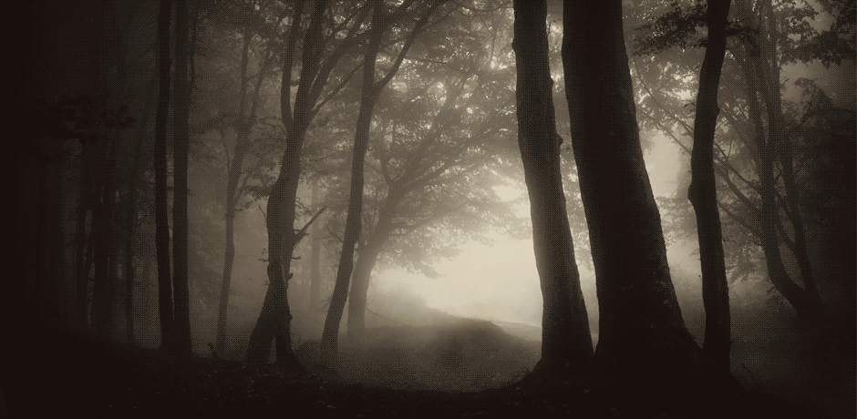
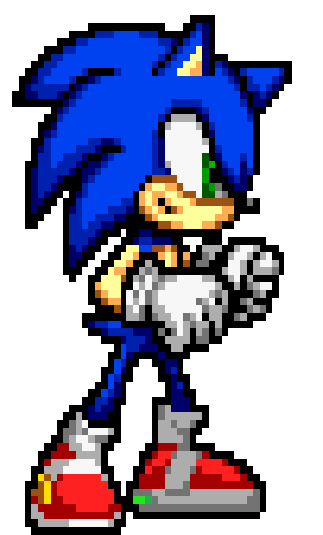
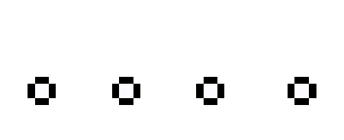

<!-- 

text -->

<!--  -->

<!--  -->

## Hi there 👋

I changed somethin'

my blog: [My Blog](https://the-coding-lab.com/)

my current project: [spasco](https://github.com/NiklasTiede/spasco)

a long term project of mine: [feedingORCAs](https://github.com/NiklasTiede/feedingORCAs)

## About Me

text

:raccoon:
:elephant:
:computer:
:musical_score:
:ocean:
:comet:
:smile_cat:
:whale:
:cherries:
:watermelon:

<!--
**NiklasTiede/NiklasTiede** is a ✨ _special_ ✨ repository because its `README.md` (this file) appears on your GitHub profile.

Here are some ideas to get you started:

- 🔭 I’m currently working on ...
- 🌱 I’m currently learning ...
- 👯 I’m looking to collaborate on ...
- 🤔 I’m looking for help with ...
- 💬 Ask me about ...
- 📫 How to reach me: ...
- 😄 Pronouns: ...
- ⚡ Fun fact: ...
-->
