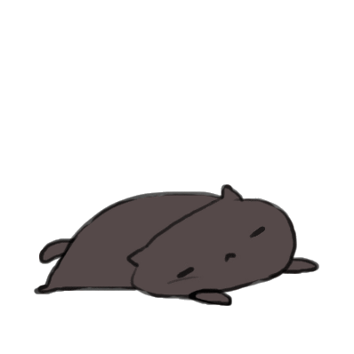

<!-- 

text -->


<!--  -->

<!--  -->

## Hey there 👋

## Hey there 

My name is Niklas and I am a chemist who really enjoys to dive into code. There are still so many projects to discover, so many stuff to build. What a time to be alive :wink:

- Visit my blog [the coding lab](https://the-coding-lab.com/) if you're  interested in cheminformatics

- Currently, I'm working on [spasco](https://github.com/NiklasTiede/spasco), a tiny command line tool

- a long term project of mine: [feedingORCAs](https://github.com/NiklasTiede/feedingORCAs)

<details>
    <summary><b>Some statistics about me...</b></summary>

<!-- ## More About Me -->

Some statictics to give prove that I do not pretend being a noob:

[](https://github.com/niklastiede/github-readme-stats)

[](https://github.com/niklastiede/github-readme-stats)

</details>
<br>

#### &#x270d; blogging ✍️

```javascript
const thai = {
  pronouns: "she" | "her",
  code: [Javascript, Typescript, HTML, CSS, Ruby, Python, Java],
  tools: [React, Redux, Node, Storybook, Styled-Components, Jest, Docker],
  architecture: ["microservices", "event-driven", "design system pattern"],
  techCommunities: {
                        coorganizer: "AfroPython",
                        speaker: "Latinity",
                        mentor: "EducaTRANSforma"
                      },
 challenge: "I am doing the #100DaysOfCode challenge focused on react and typescript"
}
```

#### 🚧 Current Projects


    
```python
​
import json
from dataclasses import asdict, dataclass


@dataclass
class Stack:
    languages   : tuple[str, ...] = ("Python", "Bash")
    databases   : tuple[str, ...] = ("PostgreSQL", "Mongo", "Redis")
    misc        : tuple[str, ...] = ("Docker", "Celery", "RQ")
    ongoing     : tuple[str, ...] = ("Django", "DRF", "JavaScript")

    def serialize(self):
        return json.dumps(asdict(self), indent=4)


stack = Stack()
print(stack.serialize())
​
```
H<sub>2</sub>SO<sub>4</sub> + 2NaOH &rarr; 2H<sub>2</sub>O + Na<sup>+</sup> + SO<sub>4</sub><sup>2-</sup>

####  🔧 Technologies & Tools

[](http://hits.dwyl.com/NiklasTiede/NiklasTiede)


## Hello, folks! 


<audio controls="controls">
  <source type="audio/mp3" src="assets/mansion_theme2.mp3"></source>
  <p>Your browser does not support the audio element.</p>
</audio>


<!-- <a href="https://github.com/NiklasTiede/feedingORCAs">
  
</a> -->

<!--  ausschneiden -->

<!-- :elephant:
:computer:
:musical_score:
:ocean:
:comet:
:smile_cat:
:whale:
:cherries:
:watermelon: -->

<!--
**NiklasTiede/NiklasTiede** is a ✨ _special_ ✨ repository because its `README.md` (this file) appears on your GitHub profile.

Here are some ideas to get you started:

- 🔭 I’m currently working on ...
- 🌱 I’m currently learning ...
- 👯 I’m looking to collaborate on ...
- 🤔 I’m looking for help with ...
- 💬 Ask me about ...
- 📫 How to reach me: ...
- 😄 Pronouns: ...
- ⚡ Fun fact: ...
-->
